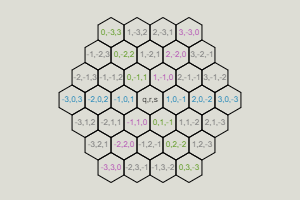
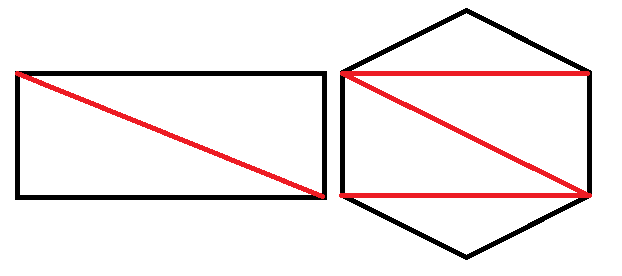

### Réalité Virtuelle - Digital Trends - IM - Heig-VD

# A-Frame : un hub VR multi-utilisateurs 

## Objectifs

- Savoir intégrer des technologies Web pour la réalisation d’une expérience VR multi-utilisateurs.
- Réaliser une application accessible via une multitude de périphériques (*responsive*).
-  Maîtriser le framework A-Frame et son architecture [Entity–component–system](https://aframe.io/docs/1.0.0/introduction/entity-component-system.html) (ECS).

## Contenu

Pour atteindre ces objectifs, nous allons développer un *Hub VR* multi-utilisateurs. Ce *hub* servira de porte d'entrée vers les projets individuels que vous développerez durant la dernière partie du cours. Il se présentera  sous la forme d'une mini expérience VR mettant en pratique les concepts de base du framework A-Frame. On y verra (entre autre) comment: 
- déplacer l'avatar de l'utilisateur (en évitant la *cinétose*)
- offrir des possibilités d'interaction avec l'environnement
- animer et déclencher des animations en fonction d'événements
- gérer les collisions pour la navigation
-  importer des *asset* 3D (*mesh*)
-  créer des *mesh* avec [three.js](https://threejs.org/) (le framework sous-jacent à A-Frame) 
- étendre le framework A-Frame via l'architecture ECS
- synchroniser des entités entres les clients connectés

## Mise en place

La version 1.0.4 du *framework* [A-Frame](https://aframe.io/docs/1.0.0/introduction/) sera utilisée. Vous pouvez donc simplement la rajouter dans votre code HTML de base (ou utiliser une des autres méthodes proposée dans la documentation officielle).

Ajoutez aussi [Aframe-Extras](https://github.com/donmccurdy/aframe-extras) à votre projet, puisque nous utiliserons certaines des fonctionnalités offertes par cet ensemble de composants.

Pour vérifier que tout fonctionne, ajouter les balises HTML nécessaires à l'affichage d'un [océan](https://github.com/donmccurdy/aframe-extras/tree/master/src/primitives) (qui servira d'environnement de base au hub VR) et tester le tout dans votre browser. Vous devriez obtenir un résultat proche de celui ci: [https://vr.chabloz.eu/ocean_base.html](https://vr.chabloz.eu/ocean_base.html).

## Environnement

### L'océan

L'océan actuelle est un peu simple, mais nous pouvons le rendre plus plaisant en faisant quelques retouches. Premièrement, agrandissez  sa taille pour qu'il couvre 100 [m^2] (toutes les distances dans A-Frame sont en **mètre** et les angles en **degré**). Ensuite, la mer est un peu trop agitée pour notre scène. Essayez donc de modifier les attributs nécessaires pour obtenir un océan plus calme (par exemple: vous pouvez réduire l'amplitude des vagues de base à 0 et leur variance à  0.1). Vous remarquerez ainsi la facilité de paramétrage des composants A-Frame grâce à l'utilisation des attributs HTML. Pour un effet intéressant, vous pouvez aussi dupliquer votre balise océan et modifier l'amplitude et la variance  du second océan. Mais bien sûr la performance sera moins bonne. Puisque nous voulons que notre scène tourne sur le plus grand nombre de périphériques, il serait utile de pouvoir la *monitorer*. A-Frame l'inclut grâce au composant [stats](https://github.com/aframevr/aframe/blob/master/docs/components/stats.md) (que vous pouvez ajouter dés maintenant). Vous trouverez des bonnes pratiques pour l'optimisation des performances ici: [A-Frame best practices](https://github.com/aframevr/aframe/blob/master/docs/introduction/best-practices.md#performance). Nous allons suivre le plus possible ces recommandations durant le développement du *hub*.  

### Le ciel

A-Frame offre le composant  [background](https://github.com/aframevr/aframe/blob/master/docs/components/background.md) afin de facilement fixer une couleur de base pour la scène. Il existe aussi un composant [a-sky](https://github.com/aframevr/aframe/blob/master/docs/primitives/a-sky.md) qui permet d'utiliser une image [cylindrique équidistante](https://fr.wikipedia.org/wiki/Projection_cylindrique_%C3%A9quidistante) comme texture intérieure pour une sphère englobant la scène. Puisque notre scène est destinée à tourner aussi sur des périphériques de faible puissance graphique, la première solution sera utilisée.

### La lumière

A-Frame ajoute par défaut une lumière d'ambiance et une lumière directionnel via le composant [light](https://github.com/aframevr/aframe/blob/master/docs/components/light.md). Vous pourriez vous contenter de ces lumières par défaut mais, pour rendre notre scène plus personnalisée, remplacez les par des lumières en accord avec le choix de couleur que vous avez fait pour votre ciel.

### Le brouillard

Afin de camoufler les bords abruptes de l'océan, vous pouvez ajouter un brouillard grâce au composant [fog](https://github.com/aframevr/aframe/blob/master/docs/components/fog.md). Voilà un exemple d'environnement obtenu après ces quelques retouches: [https://vr.chabloz.eu/ocean_quiet.html](https://vr.chabloz.eu/ocean_quiet.html)

## Pavage hexagonal

Afin de s'initier à **three.js**, le *framework* utilisé par A-Frame pour la gestion de la 3D, nous allons ajouter un nouvelle [primitive](https://aframe.io/docs/1.0.0/introduction/html-and-primitives.html) pour la création des [mesh](https://fr.wikipedia.org/wiki/Mesh_(objet)) nécessaires à un [pavage hexagonal](https://fr.wikipedia.org/wiki/Pavage_hexagonal).

Avant de commencez cette partie, il est fortement recommandé de lire cet excellent support sur l'utilisation du pavage hexagonal: [https://www.redblobgames.com/grids/hexagons/](https://www.redblobgames.com/grids/hexagons/).

Afin de simplifier la chose, nous allons nous limiter à une carte en forme d’hexagone pavé d'hexagones à sommet plat en utilisant le système des coordonnées cubiques.


### Enregistrement de la primitive et du composant

Suivez la documentation officielle pour rajouter une primitive et le composant associé nécessaire au pavage hexagonal. Pour les attributs, implémentez au minimum les suivants:

- **size**:  la taille du pavage. Une taille de 1 signifie un seul hexagone, une taille de 2 signifie un hexagone au centre et les 6 qui l'entourent et ainsi de suite. Voila un exemple pour la taille 4: 



- **color**: la couleur des tuiles hexagonale .
- **cellsize**: la taille des tuiles.
- **height**: la hauteur des tuiles.

### Les sommets (*vertices*)

Lors de la phase d'initialisation du [composant](https://github.com/aframevr/aframe/blob/master/docs/introduction/writing-a-component.md), il va falloir générer toutes les pièces utiles à la création du *mesh* complet. Il semble donc logique de commencer par la génération d'un hexagone en 2D et donc de ses sommets. Un hexagone possédant 6 sommets, un tableau semble adéquat pour les stocker. Créez donc les 6 sommets grâce à la classe [THREE.Vector2](https://threejs.org/docs/#api/en/math/Vector2) et à la formule géométrique pour le calcul de la position des sommets.

### La forme (*shape*)

Une fois les sommets créés, il faut les regrouper dans une unique forme et dessiner les arrêtes (*edges*). Créez donc une forme avec la classe [THREE.Shape](https://threejs.org/docs/#api/en/extras/core/Shape), déplacez vous sur le premier sommet (avec la méthode [moveTo](https://threejs.org/docs/#api/en/extras/core/Path.moveTo) de *Shape*) , puis tracez des lignes entre chaque sommet (grâce à la méthode  [lineTo](https://threejs.org/docs/#api/en/extras/core/Path.lineTo) de *Shape*).

### La géométrie (*geometry*)

Il faut désormais transformer la forme 2D en mesh 3D. La classe [THREE.ExtrudeGeometry](https://threejs.org/docs/#api/en/geometries/ExtrudeGeometry) permet justement d'extruder une forme 2D. Il faut lui passer en premier paramètre la forme (créée au point précédent ) et en 2e, une configuration (sous la forme d'un objet).  Comme vous pouvez le constater dans la documentation, l'on peut  appliquer un biseau (*bevel*) lors de cette opération (pour être précis, il s'agit plutôt d'un [chanfrein](https://fr.wikipedia.org/wiki/Chanfrein)). Vous pouvez soit désactiver le biseau, soit le rendre optionnel grâce à un attribut de votre primitive. Pour le paramètre **depth** des options, il s'agit (comme son nom l'indique) de la profondeur d'extrusion et correspond donc à la hauteur de l'hexagone (le paramètre **height** de votre primitive ).

Dans cet exemple [https://vr.chabloz.eu/hexagon.html](https://vr.chabloz.eu/hexagon.html), vous pouvez appuyer sur la touche 'B' de votre clavier pour observer la différence entre un hexagone extrudé sans biseau ou avec biseau. Il est **important** de noter l'impact du biseautage sur le nombre de triangles nécessaires à l'affichage de l'hexagone extrudé ! Il est aussi important de comprendre pourquoi l'hexagone extrudé a besoin de 20 triangles pour être affiché (voir l'image suivante).




### Le matériel (*material*)

Avec le framework *three.js*, les textures sont appliquées sous la forme d'un matériel (*material*).  Il existe plusieurs types de matériaux dans *three.js*,  le moins gourmand en ressource étant [THREE.MeshLambertMaterial](https://threejs.org/docs/#api/en/materials/MeshLambertMaterial), nous allons l'utiliser pour appliquer une simple texture de couleur sur notre hexagone. Comme nous n'utiliserons pas de texture, mais une simple couleur, three.js offre la possibilité de passer directement celle-ci au matériel comme ceci : 

```js
let material = new  THREE.MeshLambertMaterial({color:  new  THREE.Color(this.data.color)});
```

### Le mesh

Finalement, il faut appliquer notre matériel sur notre géométrie pour avoir un mesh final texturé. Utilsez donc la classe [THREE.Mesh](https://threejs.org/docs/#api/en/objects/Mesh) pour le faire. Pour faire un test, utiliser ce mesh *three.js* en temps que mesh *A-Frame*  grâce au code suivant:

 ```js
 this.el.setObject3D('mesh', mesh);
```

Comme vous pouvez le remarquer lors de votre test, l'orientation de l'hexagone obtenu permet de paver un mur plutôt qu'un sol.  Comme nous allons l'utiliser pour un pavage au sol, vous pouvez appliquer une rotation au mesh obtenu soit via le composant [rotation](https://github.com/aframevr/aframe/blob/master/docs/components/rotation.md) de A-Frame, soit directement avec three.js grâce à la méthode [rotateOnAxis](https://threejs.org/docs/#api/en/core/Object3D.rotateOnAxis) de three.js (plus propre) comme ceci: 

 ```js
mesh.rotateOnAxis(new  THREE.Vector3(-1, 0, 0), Math.PI / 2);
  ```

<!--stackedit_data:
eyJoaXN0b3J5IjpbMTc5NjY0MTAzMywyNzgzMTgxMDUsLTE3Mj
EzMzU3NjMsNjIzODQ3MjkxLC0xODUyNTU5ODA4LC04NjQyNDE5
NDUsLTI0NTA0MjIzNywtMTI2ODA2Mzk0MywxNzE1MzM0NTIxLD
IxMzU4NzUwODUsLTE1MTU5NDY0MiwxNDk2NTc3MTQ1LDE4NDYw
OTYwNTMsLTU1OTE1ODEyOCwzNzE1MDg4OTIsLTg0MTI3MjU1MS
wtMTE5MDQ1NzAwOCwtMjEyOTA3NzM0Nyw4Njg2ODQ0NzYsLTEy
NDAzOTA5MjBdfQ==
-->