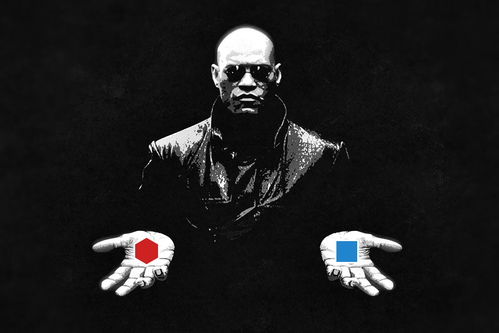
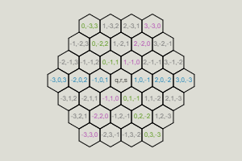
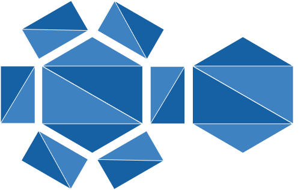

# Cours à options VR - A-Frame

## Objectifs

- S'initier au framework A-Frame et son architecture [entity–component–system](https://aframe.io/docs/1.0.0/introduction/entity-component-system.html) (ECS).
- Comprendre les concepts de _mesh_, de géométrie et de matériau de [Three.js](https://threejs.org/).

## Mise en place

La version `1.5.0` du _framework_ [A-Frame](https://aframe.io/docs/1.5.0/) sera utilisée. Vous pouvez donc simplement la rajouter dans votre code HTML de base, utiliser le [boilerplate du cours pour Vue](https://github.com/Chabloz/a-frame-vite-vue-boilerplate) (ou celle plus minimaliste pour [WebPack](https://github.com/Chabloz/a-frame-webpack-boilerplate) – /!\ A-Frame v`1.4.1`).

Ajoutez aussi [Aframe-Extras](https://github.com/c-frame/aframe-extras) à votre projet. Nous utiliserons certaines des fonctionnalités offertes par cet ensemble de composants.

Pour vérifier que tout fonctionne, ajoutez les balises HTML nécessaires à l'affichage d'un [océan](https://github.com/c-frame/aframe-extras/tree/master/src/primitives) et testez le tout dans votre browser.  
Vous devriez obtenir un résultat proche de celui-ci : [https://vr.chabloz.eu/ocean_base.html](https://vr.chabloz.eu/ocean_base.html)


## Environnement

### L'océan

L'océan actuel est un peu simple, mais nous pouvons le rendre plus plaisant en faisant quelques ajustements.

1. Premièrement, agrandissez sa taille pour qu'il couvre 100 m<sup>2</sup>.  
   Notez que toutes les distances dans A-Frame sont en **mètre** et les angles en **degré**.
2. Ensuite, la mer est un peu trop agitée pour notre scène. Essayez donc de modifier les attributs nécessaires pour obtenir un océan plus calme (ex. vous pouvez réduire l'amplitude des vagues de base à 0 et leur variance à 0.1).
   Vous remarquerez ainsi la facilité de paramétrage des composants A-Frame grâce à l'utilisation des attributs HTML.
3. Pour un effet intéressant faisant paraître les vagues moins géométrique en se chevauchant, vous pouvez dupliquer votre balise océan, puis modifier l'amplitude et la variance du second océan.
   Mais bien sûr les performances seront moins bonnes…

Puisque nous voulons que notre scène tourne sur le plus grand nombre de périphériques, il serait utile de pouvoir la _monitorer_. A-Frame l'inclut grâce au composant [stats](https://github.com/aframevr/aframe/blob/master/docs/components/stats.md) (que vous pouvez ajouter dès maintenant).

> [!TIP]
> Vous trouverez de bonnes pratiques pour l'optimisation des performances ici : [A-Frame best practices](https://github.com/aframevr/aframe/blob/master/docs/introduction/best-practices.md#performance).  
> Nous allons suivre le plus possible ces recommandations durant le développement.

### Le ciel

A-Frame offre le composant [background](https://github.com/aframevr/aframe/blob/master/docs/components/background.md) afin de facilement fixer une couleur de base pour la scène.  
Il existe aussi un composant [a-sky](https://github.com/aframevr/aframe/blob/master/docs/primitives/a-sky.md) qui permet d'utiliser une image [cylindrique équidistante](https://fr.wikipedia.org/wiki/Projection_cylindrique_%C3%A9quidistante) comme texture intérieure pour une sphère englobant la scène.  
Puisque notre scène est destinée à tourner aussi sur des périphériques de faible puissance graphique, la première solution sera utilisée.

### La lumière

A-Frame ajoute par défaut une lumière d'ambiance et une lumière directionnel via le composant [light](https://github.com/aframevr/aframe/blob/master/docs/components/light.md).  
Vous pourriez vous contenter de ces lumières, mais pour rendre notre scène plus personnalisée, remplacez les par des lumières en accord avec le choix de couleur que vous avez fait pour votre ciel.

### Le brouillard

Afin de camoufler les bords abruptes de l'océan, vous pouvez ajouter un brouillard grâce au composant [fog](https://github.com/aframevr/aframe/blob/master/docs/components/fog.md).  
Voilà un exemple d'environnement obtenu après ces quelques retouches : [https://vr.chabloz.eu/ocean_quiet.html](https://vr.chabloz.eu/ocean_quiet.html)

## Sol pavé



Afin de s'exercer nous allons créer un sol dans notre scène. Il sera constitué de différentes tuiles.  
Deux options vous sons proposées pour agencer ces tuiles :

- [Le pavage carré](#paving-square), simple à mettre en place, mais contraignant à des terrains relativement linéaires
- [Le pavage hexagonal](#paving-hexagon), un peu plus compliqué à mettre en place, masi permetant desagencement de terrains plus intéressants

Si vous hésitez, vous pouvez bien sûr vous exercez en implémentant ces deux systèmes de pavage 😉

### <a name="paving-square"></a>Pavage carré

Afin de poursuivre nos implémentation de composant A-Frame, nous allons simplement créer un [pavage carré](https://fr.wikipedia.org/wiki/Pavage_carr%C3%A9) en utilisant des cubes.

#### La boiboîte

Ajouter simplement une boîte dans votre scène (primitive _[a-box](https://aframe.io/docs/master/primitives/a-box.html)_), pour tester son affichage et jouer avec ses attributs.  
Ajustez notamment la _width_, _height_, _depth_ pour bien comprendre le sens de l'espace 3D d'A-Frame.

> [!NOTE]  
> Avec la direction par défaut de la caméra : <span style="background: red">l'axe X</span> positif s'étend vers la droite, <span style="background: green">l'axe Y</span> positif s'étend vers le haut, et <span style="background: blue">l'axe Z</span> positif s'étend hors de l'écran vers nous.

#### Pavage

En utilisant cette primitive, il va maintenant s'agir d'implémenter un composant permettant de les multiplier sur deux axes afin d'obtenir un pavage.  
De simples boucles (utilisées comme celles comme vous ferriez pour parcourir un tableau à deux dimensions) devraient permettre d'effectuer la distribution de boîtes.

```js
for (let i = 0; i < data.rows; i++) {
  for (let j = 0; j < data.cols; j++) {
    // Set box attributes and make it pop
  }
}
```

Votre composant A-Frame devra permettre de gérer :

- _tileSize_ : La taille de base d'une tuile (nous garderons la même pour la _width_ et _height_, la _depth_ sera attribuée au choix, en dur dans le composant)
- _cols_ : Le nombre de tuiles disposées sur l'aye Z
- _rows_ : Le nombre de tuiles disposées sur l'aye X
- _offset_ : Un paramètre que vous pouvez rajouter en option pour permettre d'ajouter un écart entre les tuiles sur les axes X et Z (utile pour voir que nos tuiles sont "bien là" et qu'il ne s'agit pas d'une seule grosse boîte ou d'un simple plan)

#### Décallage des tuiles

Étant donné que notre sol pavé est parfaitement plat, nous pouvons apporter un petit effet visuel de décallage entre les tuiles en les bougeant sur l'axe Y.

Créez une fonction permetant de générer une valeur aléatoire entre une valeur minimum et maximum (afin que les pavés n'est pas non plus de trop grands écarts de position).  
Vous pouvez séparer cette méthode dans le dossier `utils`, étant assez générique elle pourrait servir à d'autres endroits de notre application.  
Utiliser cette fonction pour changer la position Y de chacune des boîtes de notre pavage.

#### Damier

Pour que nos tuiles soient encore plus visibles, implémentez une logique permettant de faire varier la couleur des boîtes afin que le pavage affiche un damier (couleurs noires et blanches, ou autre duo coloré en alternance).  
Aidez-vous des index parcourant vos dimensiosn de pavage, ainsi que d'un **modulo** pour réaliser l'effet.

#### Variation des couleurs

Essayez de rajouter un système de variation de la luminosité (_light_) de la couleur de chaque tuile du pavage.  
Utilisez le mode HSL (où L spécifie la luminosité) pour adapter aléatoirement la luminosité, tout en préservant une couleur de base unie.

### <a name="paving-hexagon"></a> Pavage hexagonal

Afin de s'initier à **three.js**, le _framework_ utilisé par A-Frame pour la gestion de la 3D, nous allons ajouter un nouvelle [primitive](https://github.com/aframevr/aframe/blob/master/docs/introduction/html-and-primitives.md#registering-a-primitive) pour la création des [mesh](<https://fr.wikipedia.org/wiki/Mesh_(objet)>) nécessaires à un [pavage hexagonal](https://fr.wikipedia.org/wiki/Pavage_hexagonal).  
Cette partie du TP est inspirée de la bibliothèque de gestion de grille hexagonale [von-grid](https://github.com/vonWolfehaus/von-grid) dont nous n'allons reprendre aucun code existant, puisqu'elle ne couvre pas tous besoins et n'est pas suffisamment optimisée pour tourner correctement sur des casques à faible puissance graphique comme le Quest.

> [!IMPORTANT]
> Avant de commencez cette partie, il est fortement recommandé de lire cet **excellent support sur l'utilisation du pavage hexagonal** : [https://www.redblobgames.com/grids/hexagons/](https://www.redblobgames.com/grids/hexagons/).

Afin de simplifier la chose, nous allons nous limiter à une carte en forme d’hexagone pavé d'hexagones à sommet plat en utilisant le système des coordonnées cubiques/axiales.

#### Enregistrement de la primitive et du composant

Suivez la documentation officielle pour rajouter une primitive et le composant associé nécessaire au pavage hexagonal. Pour les attributs, implémentez au minimum les suivants :

- **size** : la taille du pavage. Une taille de 1 signifie un seul hexagone, une taille de 2 signifie un hexagone au centre et les 6 qui l'entourent et ainsi de suite. Voila un exemple pour la taille 4:



- **color** : la couleur des tuiles hexagonale
- **cellsize** : la taille des tuiles
- **height** : la hauteur des tuiles

#### Les sommets (_vertices_)

Lors de la phase d'initialisation du [composant](https://github.com/aframevr/aframe/blob/master/docs/introduction/writing-a-component.md), il va falloir générer toutes les pièces utiles à la création du _mesh_ complet. Il semble donc logique de commencer par la génération d'un hexagone en 2D et donc de ses sommets. Un hexagone possédant 6 sommets, un tableau semble adéquat pour les stocker. Créez donc les 6 sommets grâce à la classe [THREE.Vector2](https://threejs.org/docs/#api/en/math/Vector2) et à la formule géométrique pour le calcul de la position des sommets.

#### La forme (_shape_)

Une fois les sommets créés, il faut les regrouper dans une unique forme et dessiner les arrêtes (_edges_). Créez donc une forme avec la classe [THREE.Shape](https://threejs.org/docs/#api/en/extras/core/Shape), déplacez vous sur le premier sommet (avec la méthode [moveTo](https://threejs.org/docs/#api/en/extras/core/Path.moveTo) de _Shape_) , puis tracez des lignes entre chaque sommet (grâce à la méthode [lineTo](https://threejs.org/docs/#api/en/extras/core/Path.lineTo) de _Shape_).

#### La géométrie (_geometry_)

Il faut désormais transformer la forme 2D (un hexagone) en mesh 3D (un [prisme hexagonal](https://fr.wikipedia.org/wiki/Prisme_hexagonal)). La classe [THREE.ExtrudeGeometry](https://threejs.org/docs/#api/en/geometries/ExtrudeGeometry) permet justement d'extruder une forme 2D. Il faut lui passer en premier paramètre la forme (créée au point précédent ) et en 2e, une configuration (sous la forme d'un objet). Comme vous pouvez le constater dans la documentation, l'on peut appliquer un biseau (_bevel_) lors de cette opération (pour être précis, il s'agit plutôt d'un [chanfrein](https://fr.wikipedia.org/wiki/Chanfrein)). Vous pouvez soit désactiver le biseau, soit le rendre optionnel grâce à un attribut de votre primitive. Pour le paramètre **depth** des options, il s'agit (comme son nom l'indique) de la profondeur d'extrusion et correspond donc à la hauteur de l'hexagone (le paramètre **height** de votre primitive).

Dans cet exemple [https://vr.chabloz.eu/hexagon.html](https://vr.chabloz.eu/hexagon.html), vous pouvez appuyer sur la touche 'B' de votre clavier pour observer la différence entre un prisme hexagonal sans biseau ou avec biseau. Il est **important** de noter l'impact du biseau sur le nombre de triangles nécessaires à l'affichage du prisme hexagonal !  
Il est aussi important de comprendre pourquoi le prisme hexagonal a besoin de 20 triangles pour être affiché.



#### Le matériau (_material_)

Avec le framework _three.js_, les textures sont appliquées sous la forme d'un matériau (_material_). Il existe plusieurs types de matériaux dans _three.js_, le moins gourmand en ressource étant [THREE.MeshLambertMaterial](https://threejs.org/docs/#api/en/materials/MeshLambertMaterial), nous allons l'utiliser pour appliquer une simple texture de couleur sur notre hexagone. Three.js offre la possibilité de passer directement la couleur au matériau comme ceci :

```js
const material = new THREE.MeshLambertMaterial({
  color: new THREE.Color(this.data.color),
});
```

#### Le maillage (_mesh_)

Finalement, il faut appliquer notre matériau sur notre géométrie pour avoir un mesh final texturé. Utilisez donc la classe [THREE.Mesh](https://threejs.org/docs/#api/en/objects/Mesh) pour le faire. Pour faire un test, utiliser ce mesh _three.js_ en temps que mesh _A-Frame_ grâce au code suivant :

```js
this.el.setObject3D("mesh", mesh);
```

Puis ajouter votre nouvelle primitive dans votre HTML pour que l'hexagone s'affiche au dessus de votre océan.

Comme vous pouvez le remarquer lors de votre test, l'orientation de l'hexagone obtenu permet de paver un mur plutôt qu'un sol. Comme nous allons l'utiliser pour un pavage au sol, vous pouvez appliquer une rotation au mesh obtenu soit via le composant [rotation](https://github.com/aframevr/aframe/blob/master/docs/components/rotation.md) de A-Frame, soit directement avec three.js grâce à la méthode [rotateOnAxis](https://threejs.org/docs/#api/en/core/Object3D.rotateOnAxis) de three.js (plus propre) comme ceci :

```js
mesh.rotateOnAxis(new THREE.Vector3(-1, 0, 0), Math.PI / 2);
```

Pour bien comprendre pourquoi la rotation doit s'effectuer autour de l'axe X, je vous laisse lire la [documentation officielle](https://github.com/aframevr/aframe/blob/master/docs/components/position.md#value) sur le système de coordonnées utilisé par A-Frame. Vous remarquerez aussi que three.js utilise des radians comme unité angulaire alors qu'A-Frame des degrés. Une fois cette rotation effectuée, votre scène devrait ressembler à ça : [https://vr.chabloz.eu/hexagon_ocean.html](https://vr.chabloz.eu/hexagon_ocean.html)

> [!WARNING]
> Unités de mesure pour les angles :  
> **Three.js = radians**  
> **A-Frame = degrés**

#### Pavage

Pour le pavage, il va falloir cloner et positionner notre prisme hexagonal de multiple fois. Si vous avez bien lu la documentation sur le pavage hexagonale (lien directe vers les parties qui nous intéresse : [axial coordinate](https://www.redblobgames.com/grids/hexagons/#coordinates-axial), [hex to pixel](https://www.redblobgames.com/grids/hexagons/#hex-to-pixel) et [range](https://www.redblobgames.com/grids/hexagons/#range)), il vous suffit de parcourir les coordonnées axiales **q** et **r** selon la taille du pavage (attribut **size**), puis pour chaque tuile de :

- Cloner votre mesh (avec la méthode [clone()](https://threejs.org/docs/#api/en/objects/Mesh.clone) de three.js) et de l'ajouter à une structure pour le stockage des coordonnées du pavage (un tableau par exemple)

- Calculer les coordonnées **x** et **z** associées aux coordonnées **q** et **r** et à la tailles des tuiles (attribut **cellsize**), et des les attribuer au mesh cloné grâce au code suivant :

```js
clone.position.set(x, 0, z);
```

Afin de donner un pavage plus esthétique, vous pouvez aussi rajouter un écart entre les tuiles. Vous pouvez le faire simplement en réduisant la taille du mesh de l'hexagone de base en three.js comme ceci (avec gestion du biseau) :

```js
if (this.data.bevel) {
  mesh.scale.set(0.95, 0.95, 1);
} else {
  mesh.scale.set(0.98, 0.98, 1);
}
```

**Petit ajout** : Three.js offre la possibilité de stocker des données dans un mesh (sans impacter le framework) au travers de la propriété **userData**. Comme nous avons stocké nos tuiles dans un simple tableau, nous n'avons plus leurs coordonnées cubiques à disposition, alors qu'elles pourraient être utile par la suite.  
Sauvegardons donc les coordonnées de chaque clone comme ceci :

```js
const s = -q - r;
clone.userData.coordinates = { q, r, s };
```

#### Ajout des hexagones dans un groupe

Maintenant que nous avons notre pavage, il faut grouper toutes les tuiles en un seul mesh. Nous pourrions le faire en créant un groupe d'objet 3D avec [THREE.Group](https://threejs.org/docs/?q=group#api/en/objects/Group) et en ajoutant chaque tuile comme enfant (si **tilemap** est le nom de notre tableau stockant toutes les tuiles du pavage) :

```js
const group = new THREE.Group();
group.add(...this.tilemap);
this.el.setObject3D("mesh", group);
```

> [!WARNING]  
> Ce code n'est pas très optimisé. En effet tous les hexagones étant quasi les mêmes, l'utilisation de [meshs instanciés](https://threejs.org/docs/#api/en/objects/InstancedMesh) permettrait d'améliorer de beaucoup les performances.

Dans cet exemple [https://vr.chabloz.eu/hexatile_ocean.html](https://vr.chabloz.eu/hexatile_ocean.html), vous pouvez appuyer sur la touche 'O' de votre clavier pour observer la différence entre la version non-optimisée et une autre optimisée grâce au nombre de _calls_ dans les statistiques (deux de ces _calls_ sont les dessins des deux océans).  
Vous pouvez aussi changer la taille du pavage avec les touches '1' à '9'. La touche 'B' est toujours active si vous voulez tester l'impacte du biseau sur le nombre de triangles lors de pavage de taille importante. Mais n'oubliez pas de soustraire les 10'000 triangles des océans.

---

> [!NOTE]  
> **Les parties suivantes sont optionnelles, vous pouvez continuer directement à la section ["Caméra et mesh de navigation"](#cam-nav-mesh) si vous souhaitez les sauter.**

### Mise à jour (_update_)

Ajoutez une méthode [update](https://aframe.io/docs/master/core/component.html#update-olddata) à votre composant. Elle devra être capable de gérer les changements de tous les attributs requis de votre primitive (**size**, **color**, **cellsize** et **height**). Cela permettra d'animer votre pavage (voir la partie animation plus loin).

### Variation des couleurs

Essayez de rajouter un système de variation de la couleur de base pour chaque tuile du pavage. Afin de le faire proprement, voilà quelques recommandations :

- Vous pourriez faire que la variation par apport à la couleur de base soit plus ou moins grande selon la valeur d'un attribut (paramétrable).
- Il faudrait stocker la valeur de la variation affecté à chaque tuile, pour qu'en cas d'animation de changement de couleur par exemple, cette variation reste fixe (sinon cela donnera un effet stroboscopique).

Voila un exemple : [https://vr.chabloz.eu/variation.html](https://vr.chabloz.eu/variation.html). Les touches 'I' et 'K' permettent réciproquement d’augmenter ou de décrémenter la variation de couleur. Les touches 'J' et 'L' permettent réciproquement d’augmenter ou de décrémenter le nombre de variations de couleur. Enfin la touche 'C' permet de changer la couleur de manière aléatoire (Les touches des exemples précédents restent également valables).

### Zone d'aparition (_spawn zone_)

Pour mettre en pratique votre nouvelle primitive, créez une _ile_ comme zone de départ.

---

## <a name="cam-nav-mesh"></a> Caméra et mesh de navigation (_navigation mesh_ ou _navmesh_)

### Contrôle de la caméra

A-Frame ajoute une [caméra par défaut](https://aframe.io/docs/master/components/camera.html#default-camera). Elle possède les composants [look-controls](https://github.com/aframevr/aframe/blob/master/docs/components/look-controls.md) et [wasd-controls](https://github.com/aframevr/aframe/blob/master/docs/components/wasd-controls.md), qui permette respectivement de contrôler la rotation de la caméra (via la souris, le _touch_ ou le casque VR) et sa position (uniquement avec les touches _wasd_ ou les touches directionelles). Le composant **look-controls** semble idéal puisqu'il s'adapte tout seul aux environnements desktop, smartphone ou casque VR. Par contre le composant **wasd-controls** ne permet pas de gérer les collisions avec une nav-mesh ([voir plus bas](#nav-mesh)), ni de s'adapter aux différents contrôleurs de l'utilisateur (par exemple il ne fonctionne pas sur un smartphone puisque les touches _wasd_ sont inaccessibles). Nous allons donc utiliser un composant de **aframe-extra** pour la gestion des déplacements : [movement-controls](https://github.com/donmccurdy/aframe-extras/tree/master/src/controls).  
Créez donc une caméra _rig_ comme indiqué dans la documentation. Vous pouvez désormais tester votre scène avec votre smartphone pour voir que les mouvements sont fonctionnels grâce à la gestion des _touch_ par le composant.

Comme vu dans l'[état de l'art](./EtatArt.md#movements), il serait préférable de désactiver le composant **movement-controls** en VR et d'implémenter un autre système de déplacement comme la téléportation (nous le ferons dans la suite de ce TP). Pour s’entraîner encore une fois à la création de composant, et pour voir comment gérer les interactions entre composant, développez un composant nommé **disable-in-vr** qui désactivera un autre composant lorsque la scène est (ou passe) en mode VR.

Lorsque l'utilisateur explorera la scène avec un casque et des contrôleurs VR, la position et rotation des mains seront liées aux contrôleurs. Pour indiquer à A-Frame que vous voulez gérer les contrôleurs VR, il vous faut utiliser le composant [hand-controls](https://aframe.io/docs/master/components/hand-controls.html#sidebar).  
Enfin, puisque le contrôle au clavier sera désactivé, utilisez le composant [blink controls](https://github.com/jure/aframe-blink-controls) pour gérer la téléportation de la caméra (du _rig_).

### <a name="nav-mesh"> Mesh de navigation (_nav-mesh_)

Il reste un problème important…  
L'utilisateur peut désormais se déplacer dans la scène, mais ses déplacements sont beaucoup trop permissifs (il peut se [balader sur l'eau](https://media1.giphy.com/media/v1.Y2lkPTc5MGI3NjExc2xuYjFnaHA2aWdzMTNsdm1wemtyd25jdm41eXk0Nnlqa3JpbGQxMiZlcD12MV9pbnRlcm5hbF9naWZfYnlfaWQmY3Q9Zw/tHvJYAJKP5lI2CkDVy/giphy.gif) par exemple !). Il va donc nous falloir restreindre les possibilités de déplacement dans la scène.  
Il y a plusieurs possibilités pour le faire. Les deux plus utilisées sont les suivantes :

1. Utiliser un **moteur physique pour la gestion des collisions**
2. Utiliser un **mesh de navigation**

Nous allons implémenter la seconde solution puisqu'elle est beaucoup moins gourmande en performance (et qu'il est difficile de détecter une collision physique avec le bord de notre île).  
Dans les jeux vidéos, c'est souvent une combinaison de ces deux méthodes qui est utilisée pour offrir une méthode de navigation performante via les _**navmesh**_ et des possibilités d'interactions avec l'environnement via le **moteur physique**.

L'implémentation d'une _navmesh_ va être grandement simplifiée par le composant [simple-navmesh-constraint](https://github.com/AdaRoseCannon/aframe-xr-boilerplate/blob/glitch/simple-navmesh-constraint.js).  
Le principal problème sera de générer la _navmesh_ en accord avec notre scène VR. Vous pouvez le faire avec les primitives de base d'A-Frame, mais il est aussi possible de générer la _navmesh_ en utilisant [Blender](https://www.blender.org/) ou d'autres logiciels de 3D.
