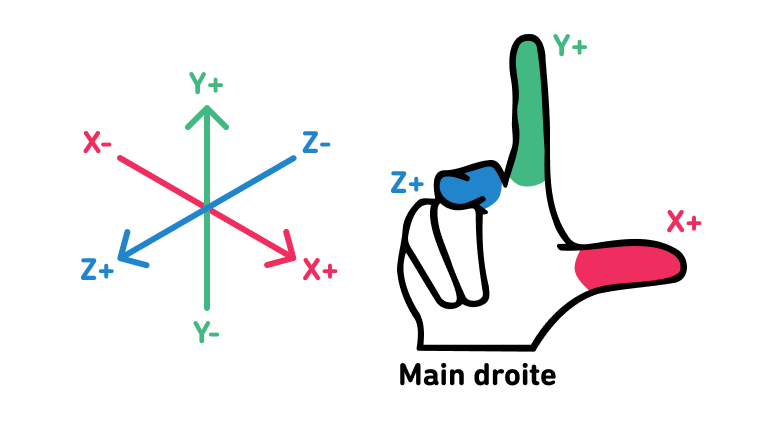

<h1 align="center">Cours à options VR - Cheat sheet</h1>

Petit regroupement des notions, documentations et références abordées.

## Documentations officielles

- [Doc A-Frame (latest)](https://aframe.io/docs/master/introduction/)
- [Doc three.js](https://threejs.org/docs/)

## Notions

Concepts clés abordés…

### Architecture Entité-Composant-Système | _Entity Component System_ / _ECS_

### Low poly

### Maillage (polygonal) | _Mesh_

### Mesh de navigation | _Navigation mesh_ / _Navmesh_

### Système de coordonnées 3D | _3D coordinate system_

Dans A-Frame :

Avec les doigts de la main droite, indiquant les axes positifs dans l'ordre :

- Pouce vers la droite (X+)
- Index vers le haut (Y+)
- Majeur vers son visage (Z+)

[Voir démo](https://glitch.com/edit/#!/a-frame-axis)

## Librairies et composants

- [C-Frame](https://github.com/c-frame) – Community maintained A-Frame components
  - [A-Frame Extras](https://github.com/c-frame/aframe-extras)

## Modèles et logiciels 3D

- [Sketchfab](https://sketchfab.com/) (_[Low poly](https://sketchfab.com/search?features=downloadable&licenses=322a749bcfa841b29dff1e8a1bb74b0b&licenses=b9ddc40b93e34cdca1fc152f39b9f375&licenses=72360ff1740d419791934298b8b6d270&licenses=bbfe3f7dbcdd4122b966b85b9786a989&licenses=2628dbe5140a4e9592126c8df566c0b7&licenses=34b725081a6a4184957efaec2cb84ed3&licenses=7c23a1ba438d4306920229c12afcb5f9&q=low+poly&type=models)_)
- [Free3D](https://free3d.com/) (_[Low poly](https://free3d.com/3d-models/lowpoly))_
- [Blender](https://www.blender.org/)
- [MeshLab](https://www.meshlab.net/)
