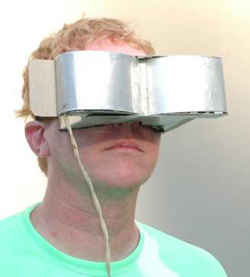
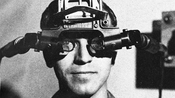
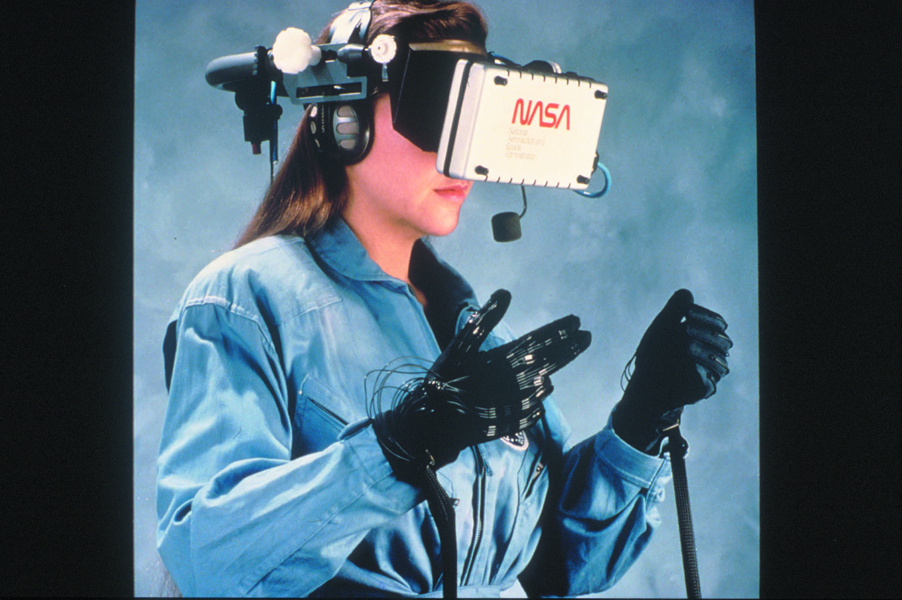
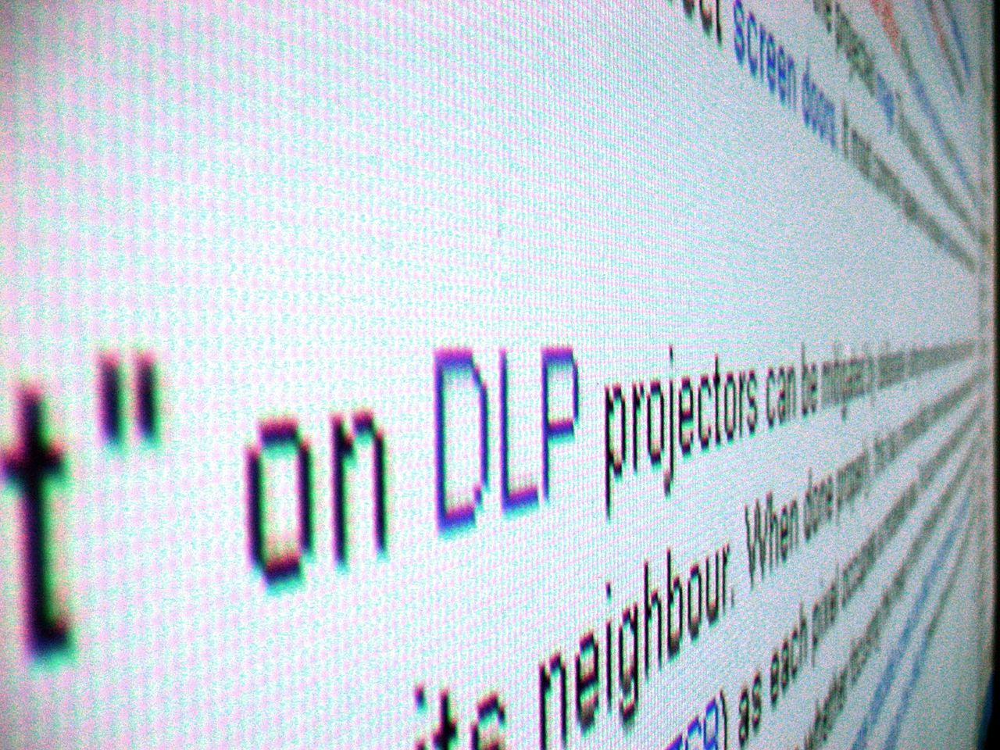
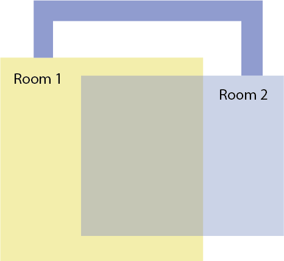

### Réalité Virtuelle - Digital Trends - IM - Heig-VD

# VR - Etat de l'art      
      
### Sommaire
- [Les applications actuelles et futures de la VR](#application-vr)
- [Historique](#histo)
- [Le matériel VR](#materiel)
- [Immersion](#immersion)
- [Déplacements](#movements)
- [Performances graphiques](#perf)
- [Audio, haptique et autres fioritures](#audio-and-co)

## Applications de la VR

- Marketing
- Jeux vidéos
- Musées
- Prototypage
- Education/formation (médecine, ...)
- Télétravail
- Cinéma (animations)
- ...

La VR, un média qui englobe tous les autres ?

##  Quelques exemples historiques

XIXe s. - [Peintures panoramiques](https://fr.wikipedia.org/wiki/Panorama_(peinture))

XIXe s. - [Stéréoscopes](https://fr.wikipedia.org/wiki/St%C3%A9r%C3%A9oscope)

1929 - [Link Trainer](https://en.wikipedia.org/wiki/Link_Trainer)

1939 - [View-Master](https://fr.wikipedia.org/wiki/View-Master)

1960 - Telesphere Mask, premier head-mounted display (HMD), Morton Heilig

1961 - Headsight, premier HMD avec motion tracking, par Comeau et Bryan

1962 - [Sensorama, Morton Heilig](https://en.wikipedia.org/wiki/Sensorama)

1968 - [The Sword of Damocles](https://en.wikipedia.org/wiki/The_Sword_of_Damocles_(virtual_reality)), premier dispositif VR, par Ivan Sutherland

1978 - [ASPEN MOVIE MAP](https://en.wikipedia.org/wiki/Aspen_Movie_Map), propotype de cartes interactives, par le MIT

1990 - [NASA-VIEW (Virtual Interface Environment Workstation)](https://www.nasa.gov/ames/spinoff/new_continent_of_ideas), casque, gants et combinaison connectés

1992 - [SEGA VR/R360](https://oculusnext.com/sega-vr/)

1995 - [Virtual Boy](https://en.wikipedia.org/wiki/Virtual_Boy)

2012 - [Oculus Rift](https://en.wikipedia.org/wiki/Oculus_Rift)

2014 - [Google Cardboard](https://en.wikipedia.org/wiki/Google_Cardboard)

 ...

## Le matériel VR

### Degrés de liberté

Un des points importants à penser lors de la conception d'une expérience VR, est la façon dont le joueur va pouvoir se déplacer et interagir avec le monde autour de lui. Pour ce qui est du point de vue matériel, on parle de **degrés de liberté (Degree of Freedom)**. Il existe aujourd'hui 2 possibilités pour le nombre de degré de liberté. La première est le 3DOF pour "Three Degrees Of Freedom", qui indique que le matériel peut suivre les mouvements de rotation effectués par le joueur (ces trois axes sont *yaw*, *pitch*  et  *roll*). La deuxième est le 6DOF pour "Six Degrees Of Freedom" qui, en plus de pouvoir suivre les mouvements de rotation, le matériel peut également suivre les mouvements de position (*forward/back*, *up/down*, *left/right*).

En général, le nombre de degrés de liberté du casque correspond à celui du contrôleur (quand il y en a un).

### Systèmes de suivi de position (*positional tracking*)
Le suivi de position est possible aujourd'hui avec les 2 techniques ci-dessous:
- Outside-in (Oculus camera ir, Valve lighthouse, ...)
- Inside-out tracking (simultaneous localization and mapping [SLAM](https://en.wikipedia.org/wiki/Simultaneous_localization_and_mapping))

La première est externe au casque et la seconde est intégrée au casque.

Pour aller plus loin sur leurs fonctionnements: [How VR Positional Tracking System Work](https://uploadvr.com/how-vr-tracking-works)

### Contrôleurs et systèmes d'interaction VR
La VR se démocratisant, les systèmes permettant d'interagir avec aussi. Voici quelqu'un des systèmes et/ou contrôleurs possibles aujourd'hui:

Pour les casques les moins chers (Google Cardboard), un système d’interaction par rapport au regard peut être mis en place simplement, un bouton ou un minuteur permettant de pointer/sélectionner des objets par rapport à la position du regard (un curseur).

Une autre façon d'interagir peu coûteuse est l'utilisation de généralement un contrôleur 3DOF (Occulus Go, Google Daydream, Samsung GearVR). Comme celui-ci ne peut suivre que les mouvements de rotation, son usage en RV se limite généralement à pouvoir pointer des objets comme une télécommande, mais également servir à se déplacer. Toutefois, certains contrôleurs peuvent approximer leurs positions et de ce fait permettent de tenir un objet ([Documentation Unity](https://developers.google.com/vr/develop/unity/controller-support)).

Les contrôleurs 6DOF quant à eux permettent de suivre avec précision leurs positions (que celle-ci soit dans la main du joueur ou ailleurs). Cela permet d'avoir une immersion quasiment parfaite, notamment quand un objet est présent dans la main joueur (épée, pistolet, sabre laser, etc...).

Enfin, sur certain des casques les plus cher ou à l'aide de senseurs supplémentaires ([Leap Motion](https://en.wikipedia.org/wiki/Leap_Motion)), il est possible de suivre la position des mains et des doigts du joueur.

Il existe bien sur d'autres types de contrôleurs plus exotique, mais ceux-ci reprenne la plupart du temps l'une des principes ci-dessus pour fonctionner.

<!-- - Gaze contrôleur ? -->
- 3DOF contrôleur
- 6DOF contrôleur
- *Tracking* des doigts
- autres systèmes -->

### Casques populaires récents
Le tableau ci-dessous présente quelqu'un des casques RV les plus récents ainsi que compatibilités avec les DoF (Degrees of Freedom).

| Casques               | Platforme     | 6DOF | Contrôleurs | Contrôleurs 6DOF | Hand Tracking
|:--------              |----------:    |:----:|:-----------:|:---------------: | :-----------:
| HTC Vive Cosmos       | PC            | ✔️    | ✔️        | ✔️               | ✔️
| Oculus Rift S         | PC            | ✔️    | ✔️        | ✔️               | ⚠
| Oculus Quest          | Standalone    | ✔️    | ✔️         ✔️               | ✔️
| Oculus Go             | Standalone    | ❌    | ✔️        | ❌               | ❌ 
| Google Cardboard      | Android       | ❌    | ❌        | ❌               | ❌
| Sony Playstation VR   | Playstation   | ✔️    | ✔️        | ✔️               | ❌
| Windows Mixed Reality* | PC            | ✔️    | ✔️        | ✔️              | ✔️

- ⚠ = En beta / pas officielement supporté 
- ✔️ = Officielement supporté
- ❌ = Non supporté|

##  Immersion

### Principales problématiques

La réalité virtuelle actuelle, bien que bien meilleure que les essais passés (voir [historique](#histo)) possède encore de nombreux freins envers une immersion idéale.  Voilà quelques points importants :

### Champ de vue (FOV)

Le [Field of view](https://vr-lens-lab.com/field-of-view-for-virtual-reality-headsets/) (FOV) n'est pas optimal sur les casques actuels. Il est en moyenne entre 90° et  110° alors que le FOV humain est entre  200° et 220°. On a donc une impression de "masque de plongée". Les futurs casques se devront d'atteindre le FOV humain pour une immersion adéquate.

[*Source*](https://fr.wikipedia.org/wiki/Champ_visuel#/media/Fichier:Champ_vision.svg)

### Le casque

Le casque lui même pose certains problèmes. Principalement, celui du confort. Bien que s'améliorant grandement à chaque génération, le poids est encore conséquent et provoque un inconfort lors des séances prolongées. 

Les casque sont parfois mal adaptés aux porteurs de lunettes. Toutefois, les lentilles peuvent être échangées avec des lentilles de correction, mais cela engendre un surcoût. 

Un autre problème important est le câble des casques reliés. Les casques autonomes n'ont bien sûr pas ce problème, mais leurs performances graphiques sont encore faibles. Toutefois, des solutions de "streaming" haute définition entre l'ordinateur et le casque existent déjà sous la forme de module externe et vont progressivement être intégrées directement aux casques.

### Les  écrans

Les écrans (où l'écran) utilisés par les casques posent aussi quelques problèmes d'immersion. Ces problèmes ne sont pas uniquement liés à la VR. Mais comme les écrans sont très proches des yeux, ils sont beaucoup plus visibles. Voici les plus importants:

- **Screen Door Effect (SDE)**:   on voit la "grille" de pixels. solutions: des écrans avec de plus haute résolution ( avec un bon agencement  des sous-pixels) ([Screen Door Effect](https://www.howtogeek.com/404491/what-is-the-screen-door-effect-in-vr/)).

[*Source*](https://en.wikipedia.org/wiki/Screen-door_effect#/media/File:Screen-door_effect.jpg)

- **Mura Effect**: les à-plats de couleurs ne sont pas homogènes à cause de la composition des écrans qui empêche une luminosité tout à fait régulière ([Mura Effect](https://www.roda-computer.com/technology/mura-effect/)).

- **Aliasing**: les arrondis sont saccadés. Puisque les écrans utilisent des pixels,  les courbes ne sont pas possibles. Cela rend les textes peu lisibles en VR. Il faut utiliser de bonnes techniques d'anti-aliasing (anticrénelage) ou utiliser des écrans à très forte densité de pixels. ([Aliasing](https://fr.wikipedia.org/wiki/Anticr%C3%A9nelage))

### Les lentilles

Les lentilles déforment (le ou) les écrans à l'intérieur du casque afin d'avoir une mise au point adéquate (qui serait sinon impossible avec un écran si proche des yeux). Mais elles engendrent aussi quelques problématiques d'immersion :

- **Centre optique (sweet spot)** : afin d'avoir une vision claire (avec un bon focus), il faut que la lentille soit correctement placée face à l’œil. Les casques VR actuels sont plus ou moins permissif sur ce sujet. De plus, la [distance pupillaire](https://en.wikipedia.org/wiki/Pupillary_distance) est différente d'un individus à l'autre. Ainsi, les casques se munissent la plupart du temps d'un système de réglage de la distance séparant les deux lentilles, permettant d'obtenir un bon "sweet spot" plus facilement.

- **Glare et "God rays"**:  En cas de scène à fort contraste, les couleurs claires (le blanc principalement) "bavent". On voit des rayons lumineux (God Rays). La cause: les lentilles Fresnel utilisées dans le casque. Pour le moment, il faut donc limiter les forts contrastes dans les scènes VR et attendre que les lentilles fassent mieux sur ce point.

- **Lentille à focale variable** : les lentilles utilisées dans les casques actuels ne sont pas à focale variable, ainsi il n'est pas possible de recréer exactement le même ressenti qu'en réalité. Les futurs lentilles (comme par exemple celles du prototype [Half Dome](https://www.oculus.com/blog/half-dome-updates-frl-explores-more-comfortable-compact-vr-prototypes-for-work), le seront. Ce système allié à celui du suivit de l’œil (eye tracking) permettra de se rapprocher de l'idéal.

## Déplacements

### Principales problématiques

- Le mal des transports ( *cinétose* ): qui se produit la plupart du temps lorsque le déplacement visualisé est décalé de celui de l'utilisateur.
 
- L'espace réel est souvent restreint à une petite partie d'une pièce, souvent entre 1 et 3 [m^2] alors que l'espace virtuel est d'une taille quelconque. 

- L'espace réel peut contenir des obstacles qui seront invisibles en VR. Et inversement, une chaise dans la réalité virtuelle ne sera (peut-être) pas physiquement présente dans la réalité. Pour le moment, quasi tous les systèmes VR utilisent un système  de **chaperon** qui permet de faire apparaître des murs virtuels dans l'espace VR lorsque l'utilisateur s'approche d'un obstacle dans le monde réel. Toutefois très peu de ces systèmes sont capables de détecter en temps réel des obstacles mobiles comme une autre personne ou un chat ! Ce sont simplement des espaces statiques prédéfinis avant l'entrée en VR.

### Déplacements et "mal des transports" (cinétose)

Une des principales règles pour éviter ce problème et de ne jamais prendre le contrôle de la caméra (et donc de la laisser être contrôlée par le système de positionnement du casque VR).  

Si l'on veut tout de même déplacer l'avatar de l'utilisateur (et donc sa caméra) dans la VR sans que celui-ci se déplace dans la réalité, il va falloir trouver des astuces pour le faire de la manière la plus confortable possible.  Le critère de **confort** se retrouve d'ailleurs dans la plupart des magasins d'applications VR (par ex. dans [l'oculus store](https://support.oculus.com/1639053389725739/)). Voilà quelques exemples de solutions :

### Téléportation

Elle ne provoque généralement pas d’inconfort, mais elle peut casser l’immersion si elle n'est pas *scénarisée* dans l'application. C'est la solution la plus utilisée dans les applications VR d'aujourd'hui. On la retrouve sous différentes variantes dont voici quelques exemples concrets:

 - **Téléportation simple** :  l'avatar est simplement téléporté vers la destination. Elle est souvent soit **libre**: l'utilisateur choisit sa destination pour la téléportation dans l'espace VR visible (et accessible), soit **limitée**: par une série de marqueurs de téléportation disposés dans l'espace VR. La téléportation limitée est souvent utilisée lors de l'utilisation de la  [photogrammétrie](https://fr.wikipedia.org/wiki/Photogramm%C3%A9trie). L'application [Welcome to Light Fields](https://www.blog.google/products/google-ar-vr/experimenting-light-fields/) en est un bon exemple. En effet puisque l'espace VR n'est pas pleinement explorable (ce sont des *photos*), l'utilisateur se téléporte alors d'un point de vue à un autre, où les points de téléportation sont les endroits ou les *photos* ont été prises.
 
 - **Portails de téléportation** :  au lieu de téléporter l'utilisateur, on le fait passer à travers des portails reliant deux zones VR distantes. Ces portails peuvent être soit fixés par les créateurs de l'application, soit par l'utilisateur lui-même (à la manière du jeu [Portal](https://fr.wikipedia.org/wiki/Portal_(jeu_vid%C3%A9o))). Un bon exemple d'utilisation de ce système est le jeu [Budget Cut](https://store.steampowered.com/app/1092430/Budget_Cuts_2_Mission_Insolvency/). 
 
 
 
 
 
 - **Autres systèmes de téléportation** :  On peut imaginer d'autres systèmes de téléportation que ceux précités. Par exemple, le système de téléportation du jeu [The Gallery](https://en.wikipedia.org/wiki/The_Gallery_(video_game)), offre au joueur la possibilité d'orienter sa téléportation dans une direction bien précise en faisant apparaître au sol l'espace réel du joueur durant la sélection de la zone de téléportation (système [*blink*](https://www.youtube.com/watch?v=fOFgAfuTtyo&feature=emb_title)). 
 
 ### Simulateurs
 
Si les déplacements sont fait via un simulateur de véhicule (voitures, avions, vaisseaux spatiaux, etc..), les risques de *cinétose* sont fortement réduits. En effet, le mal du voyage atteint rarement celui qui est maître du véhicule, mais plutôt ses passagers. Un exemple est le jeu [Elite Dangerous](https://www.elitedangerous.com/), ou le joueur reste toujours assis dans son siège (même lors des phases d'exploration de la surface d'une planète, puisque celle-ci se fait aussi dans un véhicule terrestre). L'immersion est encore plus forte si l’utilisateur utilise des contrôleurs adaptés à la simulation (comme un [HOTAS](https://fr.wikipedia.org/wiki/Mains_sur_manche_et_manette) pour Elite Dangerous).  De plus, les simulateurs bénéficient aussi d'une grande possibilité d'immersion (la chaise existant dans le monde physique) et de confort (une séance de jeu prolongée est généralement plus appréciée en position assise :).  

### Déplacements libres

Si toutefois on opte pour des déplacements libres de la caméra via un contrôleur quelconque (clavier, croix directionnelle, stick analogique, ... ), il faut éviter de faire simplement bouger la caméra sans autre forme d'artifice sous peine de provoquer un inconfort certain pour beaucoup de personnes. Le jeu [Raw Data](https://survios.com/rawdata/) utilise un système de *sprint* (ou *dash*) très rapide et  très proche de la téléportation. L'effet est quasi identique mais brise moins l'immersion. Toutefois, pour que cela ne provoque pas trop la *cinétose* la vision doit être floutée autour de la zone fovéale. Dans [Google Earth VR](https://arvr.google.com/earth/), la même méthode de *flou fovéale* est utilisée lors de l'utilisation du mode de déplacement "vol" (*flight mode*).

### Autres artifices

Si l'espace VR est de taille identique (ou plus petit que l'espace réel), la solution est simple. Il suffit à l'utilisateur de se déplacer dans la réalité pour être déplacé dans la VR de manière identique en utilisant simplement le système de positionnement du casque. Bien sûr, pour que cela soit praticable, il faut que l'application aie connaissance de la taille réelle de l'espace disponible par le joueur. Dans l'expérience immersive [theBlu](https://wevr.com/theblu),  la zone d'exploration sous-marine est générée au début de l’expérience pour que sa taille soit identique à la zone réelle de l'utilisateur. L'immersion est alors fortement accrue, encore plus du fait que le casque VR ressemble à un casque de plongée sous-marine (poids, FOV réduit, ...). 

Même si l'espace VR est plus grand que l'espace réel, il existe quelques méthodes (*astuces*) pour éviter de devoir déplacer la caméra de l'utilisateur ou d'utiliser des mécanismes de téléportation. En voici quelques-une:

- **Marche redirigée**: il s'agit de fausser la perception de l'esprit avec un décalage mouvements réels/virtuels ([Redirect walking](https://www.youtube.com/watch?v=XOxmMurUv3Q)).

- **Suites de mouvements adaptées à l'univers**, pensés pour que l'utilisateur revienne sur ses pas, et reste dans un espace restreint (identique à son espace réelle). Ce peut être fait avec l'utilisation d'ascenseurs, des techniques de chevauchement d'espaces (voir image), ou autres astuces (désorientations, distances faussées, etc...). L’expérience [Unseen Diplomacy](https://store.steampowered.com/app/429830/Unseen_Diplomacy/) reprend quelques-unes de ces idées.

 
- ***Drag and drop*** : Dans l'application [Google Earth VR](https://arvr.google.com/earth/), au lieu de téléporter l'utilisateur vers sa destination, on effectue un "drag" de la destination jusqu'à sa position désirée, ainsi l'utilisateur ne bouge pas mais c'est la terre qui bouge sous ses pieds ([Chuck Norris facts !](https://www.youtube.com/watch?v=s8uS2maPAZM)).

Bien sûr,  les techniques décrites précédemment peuvent être combinées. 

### Tapis roulant omnidirectionnel

Ce type de tapis permet le déplacement infini. Pour le moment ce sont des solutions coûteuses, encombrantes, et peu sûrs (il faut souvent y associer un système de harnais). Mais ces solutions sont prometteuses. [L'infinadeck](https://www.youtube.com/watch?v=foHmSC-MeGA)  est un exemple parmi d'autres. 

# Performances graphiques

Une autre nécessité pour ne pas provoquer de cinétose (ou briser l'immersion) est  de maintenir un taux de rafraîchissement élevé des images. Les écrans des casques actuels possèdent des fréquences variées allant de 60 [Hz] (Cardboard) à 144 [Hz] (Valve Index). Toutefois les valeurs en dessous de 90 [Hz] peuvent déjà poser problème à certains utilisateurs. Comme vu dans le chapitre des écrans, il faut aussi que ceux-ci aient une grande résolution. De plus, n’oublions pas que les calculs graphiques doivent être fait pour chaque œil (donc deux fois si vous êtes un humain avec toute ces facultés visuelles actives). Tout ceci est très gourmand en ressources graphiques.  Il semble d'ailleurs difficile d'obtenir de bonnes performances avec des cartes graphiques aux coûts abordables. Il existe heureusement quelques techniques permettant de pallier en partie à ces problèmes, comme par exemple : 

- **[Le foveated rendering](https://en.wikipedia.org/wiki/Foveated_rendering)**: seul le centre de l'image est calculé en haute définition. La résolution diminue ensuite de plus en plus en périphérie. Si cette technique est combinée avec du eye-tracking afin d'utiliser la zone où se trouve le focus de la vision de l'utilisateur plutôt que le centre de l'écran, elle peut même être indiscernable.

- **[Asynchronous interleaved reprojection](https://en.wikipedia.org/wiki/Asynchronous_reprojection)**: des images dernièrement rendues sont adaptées avec les informations de mouvements et de positionnement du casque afin d'obtenir des *frame* de "secours" en cas de perte de *framerate*. 

Bien sûr, pour obtenir de bonnes performances sur les cartes graphiques actuelles, il faut aussi que l'application VR soit bien optimisée.

# Audio, haptique, et autres fioritures

Le son en VR se doit d'être positionnel [VR positional Audio](https://realnewworld.com/vr-positional-audio/).

Gants à retour haptique :  

Les deux autres sens ? (odorat ? )

## La VR dans la fiction

### Livres
- [Ubik](https://fr.wikipedia.org/wiki/Ubik), 1969 (Philip K. Dick)
- [Neuromancien](https://fr.wikipedia.org/wiki/Neuromancien "Neuromancien"), 1984 (William Gibson)
- [Snow Crash](https://fr.wikipedia.org/wiki/Le_Samoura%C3%AF_virtuel), 1992 (Neal Stephenson)
- [La Cité des permutants](https://fr.wikipedia.org/wiki/La_Cit%C3%A9_des_permutants), 1994 (Greg Egan)
- [Sword Art Online](https://fr.wikipedia.org/wiki/Sword_Art_Online), 2009 (Reki Kawahara)
- [Ready Player One](https://fr.wikipedia.org/wiki/Player_One_(roman)), 2011 (Ernest Cline)

### Films

- [Tron](https://fr.wikipedia.org/wiki/Tron "Tron"), 1982 (Steven Lisberger)
- [The Lawnmower Man](https://fr.wikipedia.org/wiki/Le_Cobaye "Le Cobaye"), 1992 (Brett Leonard)
- [Strange Days](https://fr.wikipedia.org/wiki/Strange_Days_(film)), 1995 (Kathryn Bigelow)
- [Ghost in the shell](https://fr.wikipedia.org/wiki/Ghost_in_the_shell), 1995 (Oshii Mamoru)
- La trilogie [Matrix](https://fr.wikipedia.org/wiki/Matrix_(s%C3%A9rie_de_films)), 1998 (The Wachowskis)
- [eXistenZ](https://fr.wikipedia.org/wiki/EXistenZ), 1999 (David Cronenberg)
- [Avalon](https://fr.wikipedia.org/wiki/Avalon_(film,_2001)), 2001 (Oshii Mamoru)
- [Ready Player One](https://fr.wikipedia.org/wiki/Ready_Player_One_(film)), 2018 (Steven Spielberg)

## Sources
- [Virtual Reality Society](https://www.vrs.org.uk/virtual-reality/history.html)
- [Geek.com](https://www.geek.com/news/the-history-of-virtual-reality-games-1652225/)
- [Changing the world: DARPA’s top inventions](https://www.extremetech.com/extreme/105117-inventing-our-world-darpas-top-inventions/2)

## Auteurs
- Audrey Huguenin
- Arthur Verdon
- Nicolas Chabloz

<!--stackedit_data:
eyJoaXN0b3J5IjpbLTE2OTQzNTU2MjMsLTU3MDQ1OTE3OCwtOT
M3MTA0NzA2LDQ4OTgwMzczNCwxNzk4MjU3MTAxLC0xODI0OTQ0
NzcyLC0xNzU3MTQwMjY1LDIwODkyMTU5Niw1OTQxNzA4ODgsMT
Y2OTM5MTA2OCwxODE5NTIxOTAxLDIxMzQyNTYyMjgsLTE4Nzg3
MTQ0ODUsMTAzNDQyMzUxMywtMTQ4MTI4MDI3NSwtMjA4Nzk3Nz
U5NCwxNDczMjMyMiwtNjAyMTk3MTg1LDcwNTg4MDI4OCwxMzI3
ODkwMF19
-->